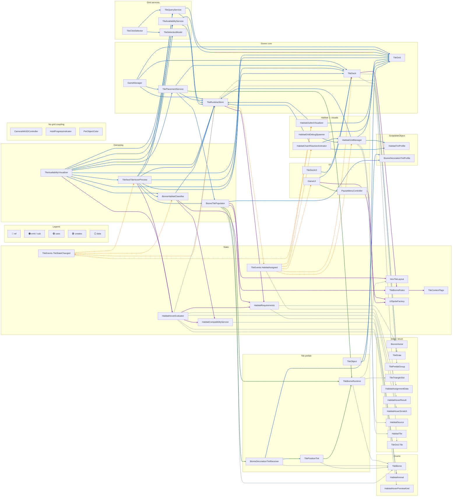

# Idle Forest — classes in the game

English translation of `docs/KLASY_I_RELACJE.md`. Keep both in sync when the architecture changes,
or drop the Polish original if it's no longer needed.

Documentation of all C# types in `Assets/Scripts/` (40 files, ~55 public types).
Relationships covered: **inheritance**, **nesting**, **SerializeField references**, **events**
(`TileEvents`).

---

## File and type tree

```
Assets/Scripts/
├── GameManager.cs                    → GameManager
├── GameUI.cs                         → GameUI
├── CameraWASDController.cs             → CameraWASDController
├── HoldProgressIndicator.cs          → HoldProgressIndicator
│
├── UI/
│   ├── PauseMenuController.cs        → PauseMenuController
│   └── UISpriteFactory.cs            → UISpriteFactory (static)
│
└── TileScripts/
    ├── BiomeVector.cs                  → HabitatAnimal (enum)
    │                                   → BiomeVector (struct)
    ├── TileBiome.cs                    → TileBiome (enum)
    │                                   → TileContentTags (static)
    │                                   → TileBiomeRules (static)
    ├── HexTileLayout.cs              → HexTileLayout (static)
    ├── TileGrid.cs                     → TileGrid
    │                                   └── TileGrid.Tile (nested)
    ├── TileRuntimeStore.cs           → TileRuntimeStore
    │                                   ├── Runtime (nested)
    │                                   └── HabitatRecord (nested)
    ├── TileEvents.cs                 → HabitatAssignmentData (struct)
    │                                   → TileEvents (static)
    ├── HabitatRequirements.cs        → HabitatRequirements (static)
    ├── HabitatCompatibilityService.cs→ HabitatCompatibilityService (static)
    ├── HabitatHoverEvaluator.cs      → HabitatHoverScratch
    │                                   → HabitatHoverPreviewKind (enum)
    │                                   → HabitatHoverResult (struct)
    │                                   → HabitatHoverEvaluator (static)
    ├── TileDeck.cs                   → TilePrefabGroup
    │                                   → TileDraw
    │                                   → TileDeck
    ├── TilePlacementService.cs       → TilePlacementService
    │                                   └── BiomeParticleEntry (private nested)
    ├── TileAvailabilityService.cs    → TileAvailabilityService
    ├── TileQueryService.cs           → TileQueryService
    ├── TileSelectionModel.cs         → TileSelectionModel
    ├── TileClickSelector.cs          → TileClickSelector
    ├── TileAvailabilityVisualizer.cs → TileAvailabilityVisualizer
    │                                   └── PlacementFeedbackKind (private enum)
    ├── TileNextTileHoverPreview.cs   → TileNextTileHoverPreview
    │                                   └── HabitatIconEntry (struct)
    ├── BiomeHabitatClassifier.cs     → BiomeHabitatClassifier
    ├── BiomeTilePopulator.cs         → BiomeTilePopulator
    │                                   ├── PrefabEntry (nested)
    │                                   ├── ContentPrefab (nested)
    │                                   ├── BiomeContent (nested)
    │                                   └── PlacementRequest (private struct)
    ├── TileBiomeRuntime.cs           → TileBiomeRuntime
    ├── TileTriangleSlot.cs           → TileTriangleSlot
    ├── TileObject.cs                 → TileObject
    ├── TilePositionTint.cs           → TilePositionTint
    ├── BiomeDecorationTintProfile.cs → BiomeDecorationTintProfile
    │                                   └── TagTintRule (nested)
    ├── BiomeDecorationTintReceiver.cs→ BiomeDecorationTintReceiver
    ├── PerObjectColor.cs             → PerObjectColor
    ├── HabitatTintProfile.cs         → HabitatTintProfile
    │                                   └── HabitatTintEntry (nested struct)
    ├── HabitatGridManager.cs         → HabitatGridManager
    ├── HabitatSource.cs              → HabitatSource (serializable data)
    ├── HabitatTile.cs                → HabitatTile (serializable data)
    ├── HabitatOutlineVisualizer.cs   → HabitatOutlineVisualizer
    ├── HabitatChainReactionAnimator.cs→ HabitatChainReactionAnimator
    ├── HabitatGridDebugSpawner.cs    → HabitatGridDebugSpawner
    └── TileDeckUI.cs                 → TileDeckUI
```

> **Not covered by this diagram**: the `Perks/` and `Quests/` folders (added after this document
> was originally written) — perk drafting, perk behaviors, and the quest catalog/manager. See
> `docs/GDD.md` §8–9 for those systems.

---

## Type legend

| Symbol | Meaning |
|--------|-----------|
| `MB` | `MonoBehaviour` — a component on a scene object / prefab |
| `SO` | `ScriptableObject` — a project asset |
| `static` | Static class — logic with no instance |
| `data` | Struct / data class (Inspector, deck, grid) |
| `event` | Global event hub |

---

## Unity inheritance

```
MonoBehaviour
├── GameManager
├── GameUI
├── CameraWASDController
├── HoldProgressIndicator
├── PauseMenuController
├── TileGrid
├── TileRuntimeStore
├── TilePlacementService
├── TileAvailabilityService
├── TileQueryService
├── TileSelectionModel
├── TileClickSelector
├── TileAvailabilityVisualizer
├── TileNextTileHoverPreview
├── TileDeck
├── TileDeckUI
├── BiomeHabitatClassifier
├── BiomeTilePopulator
├── TileBiomeRuntime          ← on the instance of a placed tile
├── TileObject                ← optionally on a tile
├── TilePositionTint          ← on the tile prefab
├── BiomeDecorationTintReceiver ← on decorations (trees, bushes…)
├── PerObjectColor
├── HabitatGridManager
├── HabitatOutlineVisualizer
├── HabitatChainReactionAnimator
└── HabitatGridDebugSpawner

ScriptableObject
├── HabitatTintProfile
└── BiomeDecorationTintProfile
```

No inheritance between the project's own classes — everything either extends a Unity type or is
plain C#.

---

## Main diagram — all classes

One view of the whole `Assets/Scripts/`. Each arrow = a separate connection.
Line colors (see `linkStyle` at the bottom of the diagram):

| Color | Type | Meaning |
|-------|-----|-----------|
| **Blue** | `ref` | `[SerializeField]` / Inspector reference |
| **Orange** | `emit` / `sub` | `TileEvents` events (dashed line) |
| **Purple** | `uses` | call into a `static` class |
| **Green** | `creates` | Instantiate / component on a prefab / `AddComponent` |
| **Gray** | `data` | type held in a field, payload, list in the Inspector |

> Scroll the diagram sideways — it's wide. In Markdown preview, zoom with Ctrl + scroll.



**Isolated** (nodes with no arrows in the diagram): `CameraWASDController`, `HoldProgressIndicator`,
`PerObjectColor`.

**Nested** (not a separate node): `TileRuntimeStore.Runtime`, `TileRuntimeStore.HabitatRecord`,
types inside `BiomeTilePopulator` — described in the table at the end of the document.

---

## Grid and runtime model

```
TileGrid
  └── Tile { i, j, q, r, worldPos, grid }
        │
        ▼
TileRuntimeStore.Runtime (per Tile)
  ├── occupied, available
  ├── occupantInstance, templatePrefab
  ├── tileDraw: TileDraw
  ├── biome: TileBiome
  ├── biomeRuntime: TileBiomeRuntime
  └── habitatIds: List<int>  (max 2)

TileRuntimeStore.HabitatRecord
  ├── Id, Animal: HabitatAnimal
  └── Tiles: List<TileGrid.Tile>
```

**Grid-based services** (all hold `TileGrid` + `TileRuntimeStore`):

| Class | Role |
|-------|-------|
| `TileQueryService` | Raycast → `Tile` |
| `TileAvailabilityService` | which neighboring cells are available |
| `TilePlacementService` | Instantiate / ghost → `MarkOccupied` |

---

## Biome and decoration layer

```
TileBiome (enum)
  └── TileBiomeRules.GetAllowedTags()
        └── BiomeTilePopulator.Populate()
              └── TileBiomeRuntime (12 × TileTriangleSlot)
                    └── HexTileLayout (triangle geometry)

Tile prefab:
  TilePositionTint ──► BiomeDecorationTintReceiver (decorations)
  TileBiomeRuntime
```

| SO asset | Usage |
|----------|--------|
| `BiomeDecorationTintProfile` | Color rules by content tag (`Tree`, `Bush`…) |
| `HabitatTintProfile` | Animal colors on tiles (`HabitatGridManager`) |

---

## Habitat logic (pure C#)

| Type | Responsibility |
|-----|------------------|
| `HabitatAnimal` | Deer, Beaver, Bear, Bees, RockDweller |
| `BiomeVector` | R⁵ biome vector; `FromTileBiome`, `Satisfies`, `DeficitSumToward` |
| `HabitatRequirements` | Requirement vectors, base points, scoring |
| `HabitatCompatibilityService` | 5×5 animal-compatibility matrix for sharing one tile |
| `HabitatHoverEvaluator` | Gray / Yellow / Green preview before placement |
| `BiomeHabitatClassifier` | Region classification following `TileStateChanged` |

`HabitatSource`, `HabitatTile` — configuration data for `HabitatGridManager` (influence sources /
tint).

> Note: `HabitatAnimal` lists a `RockDweller` value here and the compatibility matrix is shaped for
> 5 animals, but as of this translation `HabitatRequirements` only implements 4 (Deer, Beaver, Bear,
> Bees) — see `docs/GDD.md` §7.1 for the discrepancy.

---

## UI and input

| Class | Dependencies |
|-------|-------|
| `GameUI` | `TileDeck`, `TileEvents`, `UISpriteFactory`, creates `PauseMenuController` |
| `PauseMenuController` | `UISpriteFactory`, `Time.timeScale` |
| `TileDeckUI` | `TileDeck` (older deck UI) |
| `TileClickSelector` | `TileQueryService`, `TileSelectionModel` |
| `TileAvailabilityVisualizer` | full placement + hover + classifier chain |
| `TileNextTileHoverPreview` | ghost of the next tile + habitat icons |
| `HoldProgressIndicator` | progress bar (Image) |
| `CameraWASDController` | camera movement |

---

## Components on a placed tile instance (prefab)

Typical set after a tile is placed:

```
GameObject (occupant)
├── TileBiomeRuntime
├── TilePositionTint
├── TileObject (optional)
└── children with BiomeDecorationTintReceiver
```

`TileObject.AssignTile(TileGrid, TileGrid.Tile)` — binds the instance to its logical grid position.

---

## Table of all types

### MonoBehaviour (scene / prefab)

| Class | File | Main role |
|-------|------|-------------|
| `GameManager` | `GameManager.cs` | Start: center tile |
| `GameUI` | `GameUI.cs` | Score, next tile, reroll, pause |
| `CameraWASDController` | `CameraWASDController.cs` | Camera control |
| `HoldProgressIndicator` | `HoldProgressIndicator.cs` | Hold-progress UI indicator |
| `PauseMenuController` | `UI/PauseMenuController.cs` | Pause menu (ESC) |
| `TileGrid` | `TileGrid.cs` | Hexagonal grid |
| `TileRuntimeStore` | `TileRuntimeStore.cs` | Tile and habitat state |
| `TilePlacementService` | `TilePlacementService.cs` | Placing a tile |
| `TileAvailabilityService` | `TileAvailabilityService.cs` | Available cells |
| `TileQueryService` | `TileQueryService.cs` | Picking |
| `TileSelectionModel` | `TileSelectionModel.cs` | Selected tile |
| `TileClickSelector` | `TileClickSelector.cs` | Click → selection |
| `TileAvailabilityVisualizer` | `TileAvailabilityVisualizer.cs` | Markers + placement + sound |
| `TileNextTileHoverPreview` | `TileNextTileHoverPreview.cs` | Ghost + habitat preview |
| `TileDeck` | `TileDeck.cs` | Deck, draw, reroll |
| `TileDeckUI` | `TileDeckUI.cs` | Tile list in UI |
| `BiomeHabitatClassifier` | `BiomeHabitatClassifier.cs` | Habitat detection |
| `BiomeTilePopulator` | `BiomeTilePopulator.cs` | Trees, bushes, flowers in slots |
| `TileBiomeRuntime` | `TileBiomeRuntime.cs` | 12 triangles on a tile |
| `TileObject` | `TileObject.cs` | Reference to `TileGrid.Tile` |
| `TilePositionTint` | `TilePositionTint.cs` | Ground color gradient |
| `BiomeDecorationTintReceiver` | `BiomeDecorationTintReceiver.cs` | Decoration tint |
| `PerObjectColor` | `PerObjectColor.cs` | Per-renderer color |
| `HabitatGridManager` | `HabitatGridManager.cs` | Habitat color spreading |
| `HabitatOutlineVisualizer` | `HabitatOutlineVisualizer.cs` | Region outlines |
| `HabitatChainReactionAnimator` | `HabitatChainReactionAnimator.cs` | Chain-reaction animation after a habitat |
| `HabitatGridDebugSpawner` | `HabitatGridDebugSpawner.cs` | Debug: H/J sources |

### ScriptableObject

| Class | File |
|-------|------|
| `HabitatTintProfile` | `HabitatTintProfile.cs` |
| `BiomeDecorationTintProfile` | `BiomeDecorationTintProfile.cs` |

### Static classes

| Class | File |
|-------|------|
| `TileEvents` | `TileEvents.cs` |
| `HabitatRequirements` | `HabitatRequirements.cs` |
| `HabitatCompatibilityService` | `HabitatCompatibilityService.cs` |
| `HabitatHoverEvaluator` | `HabitatHoverEvaluator.cs` |
| `HexTileLayout` | `HexTileLayout.cs` |
| `TileContentTags` | `TileBiome.cs` |
| `TileBiomeRules` | `TileBiome.cs` |
| `UISpriteFactory` | `UI/UISpriteFactory.cs` |

### Enums

| Enum | Values (abridged) |
|------|-------------------|
| `TileBiome` | None, Forested, Meadow, Rocks, Bushy, Water |
| `HabitatAnimal` | None, Deer, Beaver, Bear, Bees, RockDweller |
| `HabitatHoverPreviewKind` | Gray, Yellow, Green |

### Structs and data classes

| Type | File |
|-----|------|
| `BiomeVector` | `BiomeVector.cs` |
| `HabitatAssignmentData` | `TileEvents.cs` |
| `HabitatHoverResult` | `HabitatHoverEvaluator.cs` |
| `TilePrefabGroup` | `TileDeck.cs` |
| `TileDraw` | `TileDeck.cs` |
| `TileTriangleSlot` | `TileTriangleSlot.cs` |
| `HabitatSource` | `HabitatSource.cs` |
| `HabitatTile` | `HabitatTile.cs` |
| `HabitatHoverScratch` | `HabitatHoverEvaluator.cs` |
| `TileGrid.Tile` | `TileGrid.cs` |
| `TileRuntimeStore.Runtime` | `TileRuntimeStore.cs` |
| `TileRuntimeStore.HabitatRecord` | `TileRuntimeStore.cs` |

### Nested (helper) types

| Type | Parent |
|-----|--------|
| `BiomeTilePopulator.PrefabEntry` | `BiomeTilePopulator` |
| `BiomeTilePopulator.ContentPrefab` | `BiomeTilePopulator` |
| `BiomeTilePopulator.BiomeContent` | `BiomeTilePopulator` |
| `BiomeDecorationTintProfile.TagTintRule` | `BiomeDecorationTintProfile` |
| `HabitatTintProfile.HabitatTintEntry` | `HabitatTintProfile` |
| `TileNextTileHoverPreview.HabitatIconEntry` | `TileNextTileHoverPreview` |
| `TilePlacementService.BiomeParticleEntry` | `TilePlacementService` (private) |

---

## SerializeField dependency matrix (main)

Row **uses →** column:

|  | TileGrid | TileRuntimeStore | TileDeck | TilePlacement | BiomePopulator | Classifier | AvailabilitySvc | QuerySvc | Selection | HabitatGrid |
|--|:---:|:---:|:---:|:---:|:---:|:---:|:---:|:---:|:---:|:---:|
| GameManager | ✓ | ✓ | ✓ | ✓ | | | | | | |
| TilePlacementService | | ✓ | ✓ | | ✓ | | | | | |
| TileAvailabilityVisualizer | ✓ | ✓ | ✓ | ✓ | | ✓ | ✓ | ✓ | ✓ | |
| TileNextTileHoverPreview | ✓ | ✓ | ✓ | | ✓ | ✓ | ✓ | ✓ | | |
| BiomeHabitatClassifier | | ✓ | | | | | | | | |
| HabitatGridManager | ✓ | ✓ | | | | | | | | |
| HabitatOutlineVisualizer | ✓ | ✓ | | | | | | | | |
| HabitatChainReactionAnimator | | ✓ | | | | | | | | ✓ |
| GameUI | | | ✓ | | | | | | | |

---

*Generated from `Assets/Scripts/` — Idle Forest. Translated from `docs/KLASY_I_RELACJE.md`.*
