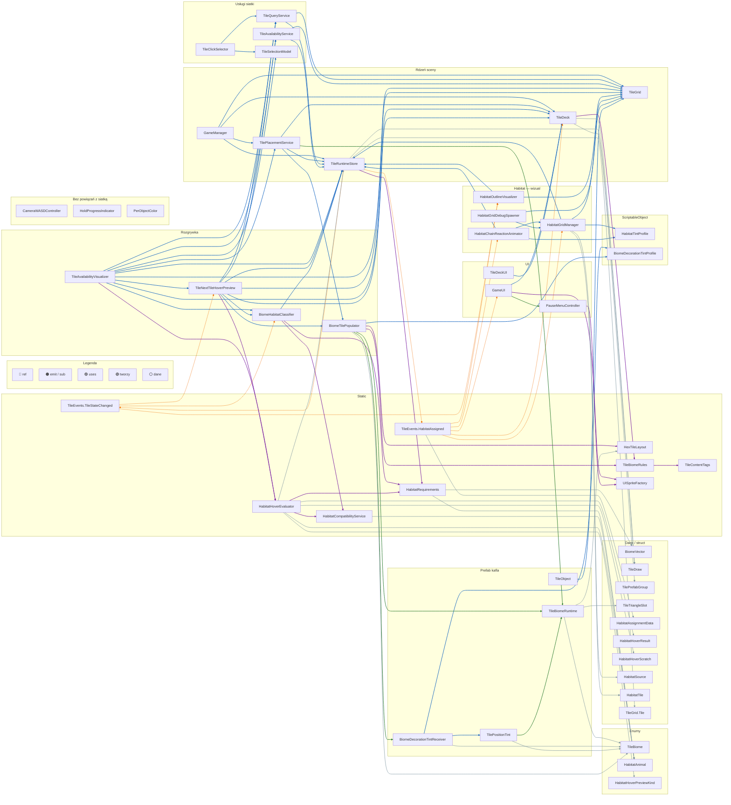

# Idle Forest — klasy w grze

Dokumentacja wszystkich typów C# w `Assets/Scripts/` (40 plików, ~55 publicznych typów).  
Relacje: **dziedziczenie**, **zagnieżdżenie**, **referencje SerializeField**, **zdarzenia** (`TileEvents`).

---

## Drzewo plików i typów

```
Assets/Scripts/
├── GameManager.cs                    → GameManager
├── GameUI.cs                         → GameUI
├── CameraWASDController.cs             → CameraWASDController
├── HoldProgressIndicator.cs          → HoldProgressIndicator
│
├── UI/
│   ├── PauseMenuController.cs        → PauseMenuController
│   └── UISpriteFactory.cs            → UISpriteFactory (static)
│
└── TileScripts/
    ├── BiomeVector.cs                  → HabitatAnimal (enum)
    │                                   → BiomeVector (struct)
    ├── TileBiome.cs                    → TileBiome (enum)
    │                                   → TileContentTags (static)
    │                                   → TileBiomeRules (static)
    ├── HexTileLayout.cs              → HexTileLayout (static)
    ├── TileGrid.cs                     → TileGrid
    │                                   └── TileGrid.Tile (nested)
    ├── TileRuntimeStore.cs           → TileRuntimeStore
    │                                   ├── Runtime (nested)
    │                                   └── HabitatRecord (nested)
    ├── TileEvents.cs                 → HabitatAssignmentData (struct)
    │                                   → TileEvents (static)
    ├── HabitatRequirements.cs        → HabitatRequirements (static)
    ├── HabitatCompatibilityService.cs→ HabitatCompatibilityService (static)
    ├── HabitatHoverEvaluator.cs      → HabitatHoverScratch
    │                                   → HabitatHoverPreviewKind (enum)
    │                                   → HabitatHoverResult (struct)
    │                                   → HabitatHoverEvaluator (static)
    ├── TileDeck.cs                   → TilePrefabGroup
    │                                   → TileDraw
    │                                   → TileDeck
    ├── TilePlacementService.cs       → TilePlacementService
    │                                   └── BiomeParticleEntry (private nested)
    ├── TileAvailabilityService.cs    → TileAvailabilityService
    ├── TileQueryService.cs           → TileQueryService
    ├── TileSelectionModel.cs         → TileSelectionModel
    ├── TileClickSelector.cs          → TileClickSelector
    ├── TileAvailabilityVisualizer.cs → TileAvailabilityVisualizer
    │                                   └── PlacementFeedbackKind (private enum)
    ├── TileNextTileHoverPreview.cs   → TileNextTileHoverPreview
    │                                   └── HabitatIconEntry (struct)
    ├── BiomeHabitatClassifier.cs     → BiomeHabitatClassifier
    ├── BiomeTilePopulator.cs         → BiomeTilePopulator
    │                                   ├── PrefabEntry (nested)
    │                                   ├── ContentPrefab (nested)
    │                                   ├── BiomeContent (nested)
    │                                   └── PlacementRequest (private struct)
    ├── TileBiomeRuntime.cs           → TileBiomeRuntime
    ├── TileTriangleSlot.cs           → TileTriangleSlot
    ├── TileObject.cs                 → TileObject
    ├── TilePositionTint.cs           → TilePositionTint
    ├── BiomeDecorationTintProfile.cs → BiomeDecorationTintProfile
    │                                   └── TagTintRule (nested)
    ├── BiomeDecorationTintReceiver.cs→ BiomeDecorationTintReceiver
    ├── PerObjectColor.cs             → PerObjectColor
    ├── HabitatTintProfile.cs         → HabitatTintProfile
    │                                   └── HabitatTintEntry (nested struct)
    ├── HabitatGridManager.cs         → HabitatGridManager
    ├── HabitatSource.cs              → HabitatSource (serializable data)
    ├── HabitatTile.cs                → HabitatTile (serializable data)
    ├── HabitatOutlineVisualizer.cs   → HabitatOutlineVisualizer
    ├── HabitatChainReactionAnimator.cs→ HabitatChainReactionAnimator
    ├── HabitatGridDebugSpawner.cs    → HabitatGridDebugSpawner
    └── TileDeckUI.cs                 → TileDeckUI
```

---

## Legenda typów

| Symbol | Znaczenie |
|--------|-----------|
| `MB` | `MonoBehaviour` — komponent na scenie / prefabie |
| `SO` | `ScriptableObject` — asset w projekcie |
| `static` | Klasa statyczna — logika bez instancji |
| `data` | Struct / klasa danych (Inspector, talia, siatka) |
| `event` | Hub zdarzeń globalnych |

---

## Dziedziczenie Unity

```
MonoBehaviour
├── GameManager
├── GameUI
├── CameraWASDController
├── HoldProgressIndicator
├── PauseMenuController
├── TileGrid
├── TileRuntimeStore
├── TilePlacementService
├── TileAvailabilityService
├── TileQueryService
├── TileSelectionModel
├── TileClickSelector
├── TileAvailabilityVisualizer
├── TileNextTileHoverPreview
├── TileDeck
├── TileDeckUI
├── BiomeHabitatClassifier
├── BiomeTilePopulator
├── TileBiomeRuntime          ← na instancji postawionego kafla
├── TileObject                ← opcjonalnie na kafelku
├── TilePositionTint          ← na prefabie kafla
├── BiomeDecorationTintReceiver ← na dekoracjach (drzewa, krzaki…)
├── PerObjectColor
├── HabitatGridManager
├── HabitatOutlineVisualizer
├── HabitatChainReactionAnimator
└── HabitatGridDebugSpawner

ScriptableObject
├── HabitatTintProfile
└── BiomeDecorationTintProfile
```

Brak dziedziczenia między własnymi klasami — wszystkie rozszerzają typy Unity lub są plain C#.

---

## Główny diagram — wszystkie klasy

Jeden widok całego `Assets/Scripts/`. Każda strzałka = osobne połączenie.  
Kolory linii (na dole diagramu `linkStyle`):

| Kolor | Typ | Znaczenie |
|-------|-----|-----------|
| **Niebieski** | `ref` | `[SerializeField]` / referencja w Inspectorze |
| **Pomarańczowy** | `emit` / `sub` | zdarzenia `TileEvents` (linia przerywana) |
| **Fioletowy** | `uses` | wywołanie klasy `static` |
| **Zielony** | `tworzy` | Instantiate / komponent na prefabie / `AddComponent` |
| **Szary** | `dane` | typ w polu, payload, lista w Inspectorze |

> Przewiń diagram w bok — jest szeroki. W podglądzie Markdown użyj zoomu (Ctrl + scroll).



**Izolowane** (węzły bez strzałek na diagramie): `CameraWASDController`, `HoldProgressIndicator`, `PerObjectColor`.

**Zagnieżdżone** (nie osobny węzeł): `TileRuntimeStore.Runtime`, `TileRuntimeStore.HabitatRecord`, typy wewnątrz `BiomeTilePopulator` — opisane w tabeli na końcu dokumentu.

---

## Model siatki i runtime

```
TileGrid
  └── Tile { i, j, q, r, worldPos, grid }
        │
        ▼
TileRuntimeStore.Runtime (per Tile)
  ├── occupied, available
  ├── occupantInstance, templatePrefab
  ├── tileDraw: TileDraw
  ├── biome: TileBiome
  ├── biomeRuntime: TileBiomeRuntime
  └── habitatIds: List<int>  (max 2)

TileRuntimeStore.HabitatRecord
  ├── Id, Animal: HabitatAnimal
  └── Tiles: List<TileGrid.Tile>
```

**Usługi oparte na siatce** (wszystkie trzymają `TileGrid` + `TileRuntimeStore`):

| Klasa | Rola |
|-------|------|
| `TileQueryService` | Raycast → `Tile` |
| `TileAvailabilityService` | które sąsiadujące pola są dostępne |
| `TilePlacementService` | Instantiate / ghost → `MarkOccupied` |

---

## Warstwa biomów i dekoracji

```
TileBiome (enum)
  └── TileBiomeRules.GetAllowedTags()
        └── BiomeTilePopulator.Populate()
              └── TileBiomeRuntime (12 × TileTriangleSlot)
                    └── HexTileLayout (geometria trójkątów)

Prefab kafla:
  TilePositionTint ──► BiomeDecorationTintReceiver (dekoracje)
  TileBiomeRuntime
```

| Asset SO | Użycie |
|----------|--------|
| `BiomeDecorationTintProfile` | Reguły koloru po tagu treści (`Tree`, `Bush`…) |
| `HabitatTintProfile` | Kolory zwierząt na kafelkach (`HabitatGridManager`) |

---

## Logika habitatów (pure C#)

| Typ | Odpowiedzialność |
|-----|------------------|
| `HabitatAnimal` | Deer, Beaver, Bear, Bees, RockDweller |
| `BiomeVector` | Wektor biomów R⁵; `FromTileBiome`, `Satisfies`, `DeficitSumToward` |
| `HabitatRequirements` | Wektory wymagań, punkty bazowe, scoring |
| `HabitatCompatibilityService` | Macierz 5×5 kompatybilności zwierząt na jednym kaflu |
| `HabitatHoverEvaluator` | Podgląd Gray / Yellow / Green przed postawieniem |
| `BiomeHabitatClassifier` | Klasyfikacja regionu po `TileStateChanged` |

`HabitatSource`, `HabitatTile` — dane konfiguracyjne dla `HabitatGridManager` (źródła wpływu / tint).

---

## UI i wejście

| Klasa | Zależności |
|-------|------------|
| `GameUI` | `TileDeck`, `TileEvents`, `UISpriteFactory`, tworzy `PauseMenuController` |
| `PauseMenuController` | `UISpriteFactory`, Time.timeScale |
| `TileDeckUI` | `TileDeck` (starszy UI talii) |
| `TileClickSelector` | `TileQueryService`, `TileSelectionModel` |
| `TileAvailabilityVisualizer` | pełny łańcuch placement + hover + classifier |
| `TileNextTileHoverPreview` | ghost następnego kafla + ikony habitatów |
| `HoldProgressIndicator` | pasek postępu (Image) |
| `CameraWASDController` | ruch kamery |

---

## Komponenty na instancji kafla (prefab)

Po postawieniu kafelka typowy zestaw:

```
GameObject (occupant)
├── TileBiomeRuntime
├── TilePositionTint
├── TileObject (opcjonalnie)
└── children z BiomeDecorationTintReceiver
```

`TileObject.AssignTile(TileGrid, TileGrid.Tile)` — powiązanie z logiczną pozycją na siatce.

---

## Tabela wszystkich typów

### MonoBehaviour (scena / prefab)

| Klasa | Plik | Główna rola |
|-------|------|-------------|
| `GameManager` | `GameManager.cs` | Start: kafel centralny |
| `GameUI` | `GameUI.cs` | Wynik, następny kafel, reroll, pauza |
| `CameraWASDController` | `CameraWASDController.cs` | Sterowanie kamerą |
| `HoldProgressIndicator` | `HoldProgressIndicator.cs` | UI wskaźnika przytrzymania |
| `PauseMenuController` | `UI/PauseMenuController.cs` | Menu pauzy (ESC) |
| `TileGrid` | `TileGrid.cs` | Siatka heksagonalna |
| `TileRuntimeStore` | `TileRuntimeStore.cs` | Stan kafli i habitatów |
| `TilePlacementService` | `TilePlacementService.cs` | Postawienie kafla |
| `TileAvailabilityService` | `TileAvailabilityService.cs` | Dostępne pola |
| `TileQueryService` | `TileQueryService.cs` | Picking |
| `TileSelectionModel` | `TileSelectionModel.cs` | Wybrany kafel |
| `TileClickSelector` | `TileClickSelector.cs` | Klik → selekcja |
| `TileAvailabilityVisualizer` | `TileAvailabilityVisualizer.cs` | Markery + placement + dźwięk |
| `TileNextTileHoverPreview` | `TileNextTileHoverPreview.cs` | Ghost + podgląd habitatów |
| `TileDeck` | `TileDeck.cs` | Talia, draw, reroll |
| `TileDeckUI` | `TileDeckUI.cs` | Lista kafli w UI |
| `BiomeHabitatClassifier` | `BiomeHabitatClassifier.cs` | Wykrywanie habitatów |
| `BiomeTilePopulator` | `BiomeTilePopulator.cs` | Drzewa, krzaki, kwiaty w slotach |
| `TileBiomeRuntime` | `TileBiomeRuntime.cs` | 12 trójkątów na kafelku |
| `TileObject` | `TileObject.cs` | Referencja do `TileGrid.Tile` |
| `TilePositionTint` | `TilePositionTint.cs` | Gradient koloru podłoża |
| `BiomeDecorationTintReceiver` | `BiomeDecorationTintReceiver.cs` | Tint dekoracji |
| `PerObjectColor` | `PerObjectColor.cs` | Per-renderer color |
| `HabitatGridManager` | `HabitatGridManager.cs` | Rozprzestrzenianie koloru habitatów |
| `HabitatOutlineVisualizer` | `HabitatOutlineVisualizer.cs` | Obrysy regionów |
| `HabitatChainReactionAnimator` | `HabitatChainReactionAnimator.cs` | Animacja łańcucha po habitcie |
| `HabitatGridDebugSpawner` | `HabitatGridDebugSpawner.cs` | Debug: źródła H/J |

### ScriptableObject

| Klasa | Plik |
|-------|------|
| `HabitatTintProfile` | `HabitatTintProfile.cs` |
| `BiomeDecorationTintProfile` | `BiomeDecorationTintProfile.cs` |

### Klasy statyczne

| Klasa | Plik |
|-------|------|
| `TileEvents` | `TileEvents.cs` |
| `HabitatRequirements` | `HabitatRequirements.cs` |
| `HabitatCompatibilityService` | `HabitatCompatibilityService.cs` |
| `HabitatHoverEvaluator` | `HabitatHoverEvaluator.cs` |
| `HexTileLayout` | `HexTileLayout.cs` |
| `TileContentTags` | `TileBiome.cs` |
| `TileBiomeRules` | `TileBiome.cs` |
| `UISpriteFactory` | `UI/UISpriteFactory.cs` |

### Enumy

| Enum | Wartości (skrót) |
|------|-------------------|
| `TileBiome` | None, Forested, Meadow, Rocks, Bushy, Water |
| `HabitatAnimal` | None, Deer, Beaver, Bear, Bees, RockDweller |
| `HabitatHoverPreviewKind` | Gray, Yellow, Green |

### Structy i klasy danych

| Typ | Plik |
|-----|------|
| `BiomeVector` | `BiomeVector.cs` |
| `HabitatAssignmentData` | `TileEvents.cs` |
| `HabitatHoverResult` | `HabitatHoverEvaluator.cs` |
| `TilePrefabGroup` | `TileDeck.cs` |
| `TileDraw` | `TileDeck.cs` |
| `TileTriangleSlot` | `TileTriangleSlot.cs` |
| `HabitatSource` | `HabitatSource.cs` |
| `HabitatTile` | `HabitatTile.cs` |
| `HabitatHoverScratch` | `HabitatHoverEvaluator.cs` |
| `TileGrid.Tile` | `TileGrid.cs` |
| `TileRuntimeStore.Runtime` | `TileRuntimeStore.cs` |
| `TileRuntimeStore.HabitatRecord` | `TileRuntimeStore.cs` |

### Zagnieżdżone (pomocnicze)

| Typ | Rodzic |
|-----|--------|
| `BiomeTilePopulator.PrefabEntry` | `BiomeTilePopulator` |
| `BiomeTilePopulator.ContentPrefab` | `BiomeTilePopulator` |
| `BiomeTilePopulator.BiomeContent` | `BiomeTilePopulator` |
| `BiomeDecorationTintProfile.TagTintRule` | `BiomeDecorationTintProfile` |
| `HabitatTintProfile.HabitatTintEntry` | `HabitatTintProfile` |
| `TileNextTileHoverPreview.HabitatIconEntry` | `TileNextTileHoverPreview` |
| `TilePlacementService.BiomeParticleEntry` | `TilePlacementService` (private) |

---

## Macierz zależności SerializeField (główne)

Wiersz **używa →** kolumna:

|  | TileGrid | TileRuntimeStore | TileDeck | TilePlacement | BiomePopulator | Classifier | AvailabilitySvc | QuerySvc | Selection | HabitatGrid |
|--|:---:|:---:|:---:|:---:|:---:|:---:|:---:|:---:|:---:|:---:|
| GameManager | ✓ | ✓ | ✓ | ✓ | | | | | | |
| TilePlacementService | | ✓ | ✓ | | ✓ | | | | | |
| TileAvailabilityVisualizer | ✓ | ✓ | ✓ | ✓ | | ✓ | ✓ | ✓ | ✓ | |
| TileNextTileHoverPreview | ✓ | ✓ | ✓ | | ✓ | ✓ | ✓ | ✓ | | |
| BiomeHabitatClassifier | | ✓ | | | | | | | | |
| HabitatGridManager | ✓ | ✓ | | | | | | | | |
| HabitatOutlineVisualizer | ✓ | ✓ | | | | | | | | |
| HabitatChainReactionAnimator | | ✓ | | | | | | | | ✓ |
| GameUI | | | ✓ | | | | | | | |

---

*Wygenerowano na podstawie `Assets/Scripts/` — Idle Forest.*
